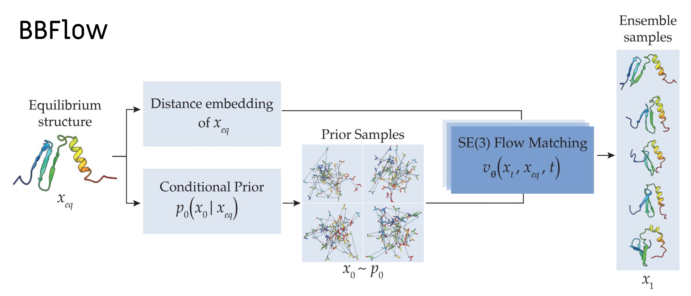

# Learning conformational ensembles of proteins with BBFlow



Structure-based conformational ensemble prediction with flow matching. The method is described in the paper [Learning conformational ensembles of proteins based on backbone geometry](https://arxiv.org/abs/2503.05738).

In this Readme, we provide instructions for running inference, downloading the preprocessed ATLAS, training BBFlow models, and provide ressources to reproduce the results from the paper.

This repository relies on the [GAFL](https://github.com/hits-mli/gafl) package and code from [FrameFlow](https://github.com/microsoft/protein-frame-flow).

---

<details open><summary><b>Table of contents</b></summary>
  
- [Usage](#usage)
- [Colab Tutorial](#google-colab-tutorial)
- [Installation](#installation)
- [Downloads](#downloading-the-preprocessed-atlas-dataset)
- [Training](#training)
- [Citation](#citation)
</details>

## Usage

After installing the bbflow package, you can generate ensemble directly in python:

```python
from bbflow.deployment.bbflow import BBFlow
bbflow_sampler = BBFlow.from_tag('latest')
bbflow_sampler.sample(input_path='<path/to/equilibrium.pdb>', output_path='<path/to/output_ensemble.pdb>', num_samples=50)
```

or by using the command line interface:

```bash
bbflow_sample --input_path <path/to/equilibrium.pdb> --output_path <path/to/output_ensemble.pdb> --num_samples 50
```

For more details, see the example scripts at `scripts/inference_example.py` and `scripts/inference_example.sh`.

## Google Colab Tutorial

We also provide an [example notebook in Google Colab](https://colab.research.google.com/drive/11_xvYYOM5ckmY9PiKUCLcAAB_cIpfzG4?usp=sharing), for which no local installation is required.


## Installation

### TLDR

You can use our install script (here for torch version 2.6.0, cuda 12.4), which esssentially executes the steps specified in section **pip** below:

```bash
git clone https://github.com/graeter-group/bbflow.git
conda create -n bbflow python=3.12 -y
conda activate bbflow && bash bbflow/install_utils/install_via_pip.sh 2.6.0 124
```

Verify your installation by running our example script or `pytest`:

```bash
bash bbflow/scripts/inference_example.sh
```

If the installation fails, you might want to try passing the python version to the install script, e.g. `bash bbflow/install_utils/install_via_pip.sh 2.6.0 124 3.12` for python 3.12, for using a versioned requirements file that was found to be compatible with the respective python version.

### pip

Optional: Create a virtual environment, e.g. with conda and python 3.12:

```bash
conda create -n bbflow python=3.12 -y
conda activate bbflow
```

Install the dependencies from the requirements file:

```bash
git clone https://github.com/graeter-group/bbflow.git
pip install -r bbflow/install_utils/requirements.txt

# BBFlow builds on top of the GAFL package, which is installed from source:
git clone https://github.com/hits-mli/gafl.git
cd gafl
bash install_gatr.sh # Apply patches to gatr (needed for gafl)
pip install -e . # Install GAFL
cd ..

# Finally, install bbflow with pip:
cd bbflow
pip install -e .
```

Install torch with a suitable cuda version, e.g.

```bash
pip install torch==2.6.0 --index-url https://download.pytorch.org/whl/cu124
pip install torch-scatter -f https://data.pyg.org/whl/torch-2.6.0+cu124.html
```

where you can replace cu124 by your cuda version, e.g. cu118 or cu121.

Note that you can also find requirements files with specific versions that were found to be compatible with python 3.10 and 3.12, respectively, in `install_utils`.

### conda

BBFlow relies on the [GAFL](https://github.com/hits-mli/gafl) package, which can be installed from GitHub as shown below. The dependencies besides GAFL are listed in `install_utils/environment.yaml`, we also provide a minimal environment in `install_utils/minimal_env.yaml`, where it is easier to change torch/cuda versions.

```bash
# download bbflow:
git clone https://github.com/graeter-group/bbflow.git
# create env with dependencies:
conda env create -f bbflow/install_utils/minimal_env.yaml
conda activate bbflow

# install gafl:
git clone https://github.com/hits-mli/gafl.git
cd gafl
bash install_gatr.sh # Apply patches to gatr (needed for gafl)
pip install -e .
cd ..

# install bbflow:
cd bbflow
pip install -e .
```

### Common installation issues

Problems with torch_scatter can usually be resolved by uninstalling and re-installing it via pip for the correct torch and cuda version, e.g. `pip install torch-scatter -f https://data.pyg.org/whl/torch-2.0.0+cu124.html` for torch 2.0.0 and cuda 12.4.

## Ensembles from the paper

You can download the de novo dataset and ensembles from Tables 1 and 2 of the paper by the following commands:

```bash
wget --content-disposition https://keeper.mpdl.mpg.de/f/22d60c88713147d7be80/?dl=1 # bbflow ensembles for ATLAS, de novo and multimer datasets
wget --content-disposition https://keeper.mpdl.mpg.de/f/3447cc7553284aa6a45b/?dl=1 # bbflow-light ensembles for both ATLAS and de novo datasets
wget --content-disposition https://keeper.mpdl.mpg.de/f/f3905ea04da0457d8b7a/?dl=1 # de novo ensembles generated by the baselines
```

We also provide the MD datasets for de novo and multimeric proteins introduced in the paper:

```bash
wget --content-disposition https://keeper.mpdl.mpg.de/f/ad782834b43f4b2ab8d8/?dl=1 # de novo MD dataset
wget --content-disposition https://keeper.mpdl.mpg.de/f/60ce3bef1a99437e8d08/?dl=1 # multimer MD dataset
```

## Downloading the preprocessed ATLAS dataset

To download the preprocessed ATLAS dataset, you can use the provided script `download_atlas.py`. This script will download the dataset and prepare it for training and evaluation. By default, it creates a `./datasets/ATLAS` directory with the data.

```bash
python scripts/download_atlas.py
```

For testing, you can also reduce the number of downloaded entries per train/validation/test split:

```bash
python scripts/download_atlas.py --max_entries_per_split 100
```

## Downloading pre-trained models

You can download a set of pretrained BBFlow models by running `scripts/download_models.py`.

## Training

If you have downloaded the ATLAS dataset as described above into `./datasets/ATLAS`, and are logged in to [wandb](https://wandb.ai/home) you can start training a BBFlow model with the following command:

```bash
python experiments/train.py experiment.wandb.name=default-settings
```

The training settings can be adapted by modifying the config files in `configs/` or overwriting them in the command line as shown above.
Please not that the metric calculation in the validation step takes several minutes and can lead to timeout errors in multi-GPU training depending on your system. You can disable it by setting `experiment.first_val_epoch=inf`.

## Generating ATLAS ensembles with trained models

You can generate ensembles using a trained model by running

```bash
python experiments/inference.py inference.ckpt_path=<path/to/checkpoint.ckpt>
```

If you downloaded the pretrained models as described above, you can run quickly test this by

```bash
python experiments/inference.py inference.ckpt_path=models/bbflow-mini-0.1/bbflow-mini-0.1.ckpt inference.num_proteins=3
```

If you want to run this for other proteins than the ATLAS test set, you can provide a CSV file via the inference config parameter `csv_path`.

## Analysis script

After generation, e.g. through `experiments/inference.py`, the evaluation of generated samples can also be run separately by `scripts/analysis_script.py`, e.g. after generating ensembles with the bbflow-mini-0.1 model:

```bash
python scripts/analysis_script.py --md_dirs datasets/ATLAS/ --ensemble_dirs outputs/inference/models/bbflow-mini-0.1/bbflow-mini-0.1/run_xxxx-xx-xx_xx-xx/
```

In general, the analysis script expects `md_dirs` to contain directories `<name>` with pdb and xtc files, `name/name.pdb` and `name/name_R{1}.xtc`, and the `ensemble_dirs` to contain `<name>/sampled_conformations.pdb` files.

## Citation

```
@article{wolf2025conformational,
      title={Learning conformational ensembles of proteins based on backbone geometry}, 
      author={Nicolas Wolf and Leif Seute and Vsevolod Viliuga and Simon Wagner and Jan Stühmer and Frauke Gräter},
      year={2025},
      eprint={2503.05738},
      archivePrefix={arXiv},
      journal={arXiv preprint arXiv:2503.05738},
}
```

Please cite the paper if you use the code.

This repository relies on the [GAFL](https://github.com/hits-mli/gafl) package and code from [FrameFlow](https://github.com/microsoft/protein-frame-flow).
